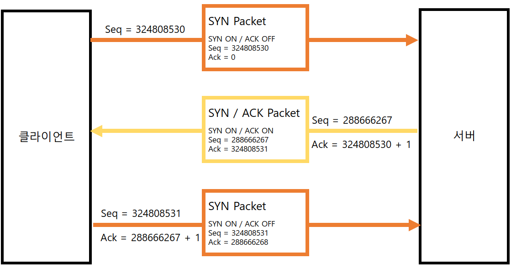

# Day1 정리
Q. 객체 지향 프로그래밍 언어에 대해 설명해주세요.

⇒ 객체는 메소드와 변수를 가지며, 특정적인 역할을 수행하는 것을 말합니다. 이 객체 단위로 나눠서 프로그램을 처리하는 개발 언어를 객체지향 프로그래밍 언어라고 합니다.

Java, C++이 대표적인 객체 지향 프로그래밍 언어입니다.

※ 객체지향 프로그래밍 4가지 특징

1. 캡슐화 (정보은닉)
2. 상속
3. 다형성
4. 추상화

 

Q. Java 추상 클래스의 대해 설명해주세요.

⇒ 자식 클래스에서 반드시 오버라이딩 해야만 사용할 수 있는 메소드를 의미합니다.

※ 오버라이딩이란?

→ 상속 관계에 있는 클래스에서 상위 클래스의 메서드를 하위 클래스에서 재정의하는 것을 말합니다.

예시 : 

Q. 교착 상태(Dead Lock)에 대해 설명해주세요.

→ 두 개 이상의 프로세스나 스레드가 서로 다른 작업이 끝나기만을 기다리고 있기 때문에 아무것도 완료되지 못하는 상태이다.

Q. HDLC(High-Level Data Link Control) 프로콜에 대해 설명해주세요.

고급 데이터 연결 제어(High-Level Data Link Control, HDLC) 혹은 고수준 데이터 전송 제어

⇒ ISO(국제 표준화 기구)에서 개발한 비트 지향 코드 투명 동기 데이터 링크 계층 프로토콜로 표준 HDLC는 **ISO/IEC 13239:2002**이다. 

Q. 3-way handshaking에 대해 설명해주세요.

→ TCP/IP 프로토콜을 이용해 통신하는 응용프로그램이 데이터를 전송하기 전에 먼저 정확한 전송을 보장하기 위해서 상대방 컴퓨터와 사전에 세션을 수립하는 과정을 의미한다.

Q. SYN Flooding에 대해 설명해주세요.

→ SYN 패킷이 흘러 넘친다는 뜻으로 과도한 SYN 패킷을 서버에게 전송하여 서버에게 많은 부하를 발생하게 하여 서버가 재기능을 못하도록 하는 것을 말한다.

@ 3-way handshaking와 SYN Flooding 참고 ref

[https://sata.kr/entry/DOSDDOS-SYN-Flooding-공격에-대해서-알아보자](https://sata.kr/entry/DOSDDOS-SYN-Flooding-%EA%B3%B5%EA%B2%A9%EC%97%90-%EB%8C%80%ED%95%B4%EC%84%9C-%EC%95%8C%EC%95%84%EB%B3%B4%EC%9E%90)

https://run-it.tistory.com/51

Q. 데이터베이스에서 트리거란 무엇인가요?

→ 데이터베이스에서 자동으로 실행되는 작업을 의미하며, 데이터 조작 언어(DML)의 데이터 상태의 관리를 자동화하는 데 사용된다.

+) 테이블과 뷰 데이터베이스 작업을 대상으로 정의할 수 있으며, 전체 트랜잭션 작업에 대해 발생되는 트리거(Trigger)와 각행에 대해 발생되는 트리거(Trigger)가 있습니다.

Q. SOAP에 대해서 설명해주세요.

→ SOAP(Simple Object Access Protocol)은 일반적으로 널리 알려진 ***HTTP, HTTPS, SMTP*** 등을 통해 **XML 기반**의 메시지를 컴퓨터 네트워크 상에서 교환하는 **프로토콜**이다.

Q. REST에 대해서 설명해주세요.

→ REST(Representational State Transfer)의 약자로 자원을 이름으로 구분하여 해당 자원의 상태를 주고받는 모든 것을 의미합니다.

1. HTTP URI(Uniform Resource Identifier)를 통해 자원(Resource)을 명시하고,
2. HTTP Method(POST, GET, PUT, DELETE, PATCH 등)를 통해
3. 해당 자원(URI)에 대한 CRUD Operation을 적용하는 것을 의미합니다.

※ **CRUD Operation이란**

CRUD는 대부분의 컴퓨터 소프트웨어가 가지는 기본적인 데이터 처리 기능인 Create(생성), Read(읽기), Update(갱신), Delete(삭제)를 묶어서 일컫는 말로

REST에서의 CRUD Operation 동작 예시는 다음과 같다.

- Create : 데이터 생성(POST)
- Read : 데이터 조회(GET)
- Update : 데이터 수정(PUT, PATCH)
- Delete : 데이터 삭제(DELETE)

### **REST 구성 요소**

REST는 다음과 같은 3가지로 구성이 되어있다.

1. **자원(Resource) : HTTP URI**
2. **자원에 대한 행위(Verb) : HTTP Method**
3. **자원에 대한 행위의 내용 (Representations) : HTTP Message Pay Load**

### **REST의 특징**

1. Server-Client(서버-클라이언트 구조)
2. Stateless(무상태)
3. Cacheable(캐시 처리 가능)
4. Layered System(계층화)
5. Uniform Interface(인터페이스 일관성)

참고 ref

[https://khj93.tistory.com/entry/네트워크-REST-API란-REST-RESTful이란](https://khj93.tistory.com/entry/%EB%84%A4%ED%8A%B8%EC%9B%8C%ED%81%AC-REST-API%EB%9E%80-REST-RESTful%EC%9D%B4%EB%9E%80)

Q. 화이트박스 테스트 검정 기준에 대해서 설명해주세요.

**화이트박스 테스트(White Box Test)**

화이트박스란?

→ 초기에 모듈의 원시 코드를 오픈시킨 상태에서 원시 코드의 논리적인 모든 경로를 테스트해서 테스트 케이스(항목)을 설계하는 방식이다.

모듈 안의 작동을 직접 관찰 할 수 있고 Source Code의 모든 문장을 한 번 이상 실행함으로써 수행된다.

화이트박스 테스트의 종류
|테스트 종류|설명|
|------|---|
|기초 경로 검사(Base Path Testing)|테스트 케이스의 설계자가 코드의 복잡성을 측정할 수 있게 해주는 테스트 기법 대표적인 화이트박스 테스트 기법이다.|
|제어 구조 검사(Control Structure Testing)|논리적 조건, 반복구조, 데이터의 흐름을 테스트 한다.- 조건 검사 (Condition Testing) : 프로그램 모듈내에 논리적 조건을 테스트 하는 테스트 케이스 설계기법- 반복 검사(Loop Testing) : 반복구조에 초점을 맞춰 실시하는 테스트 설계기법 - 데이터 흐름 검사 (Data Flow Testing) : 실제 사용자들이 입력하는 갑들을 변수에 넣을때 변수 정의와 변수 사용 위치를 어떻게 했는지 초점을 맞춰서 테스트하는 설계 기법|

화이트 박스 테스트의 검증 기준
|제목|내용|
|------|---|
|문장 검증 기준(Statement Coverage)|소스 코드의 모든 구문을 한 번 이상 수행 되도록 항목 설계|
|분기 검증 기준(Branch Coverage)|소스 코드의 모든 조건문을 한 번 이상 수행되도록 항목 설계|
|조건 검증 기준(Condition Coverage)|소스 코드의 모든 조건문의 참, 거짓을 각 한번 이상 수행되도록 항목 설계|
|분기/조건 기준(Branch/Condition Coverage)|소스 코드의 모든 조건문과 각 조건문에 포함된 개별 조건식의 결과가 참, 거짓인 경우 각각을 한 번 이상 수행되도록 항목 설계|
##
##
# Day1 한줄 요약
# 
# 1. 객체 지향 프로그래밍 언어에 대해 설명해주세요.
- 객체는 메소드와 변수를 가지며, 특정적인 역할을 수행하는 것을 말합니다. 
이 객체 단위로 나눠서 프로그램을 처리하는 개발 언어를 객체지향 프로그래밍 언어라고 합니다.

# 2. Java 추상 클래스의 대해 설명해주세요.
- 자식 클래스에서 반드시 ***오버라이딩*** 해야만 사용할 수 있는 메소드를 의미합니다.

# 3. 교착 상태(Dead Lock)에 대해 설명해주세요.
- 두 개 이상의 프로세스나 스레드가 서로 다른 작업이 끝나기만을 기다리고 있기 때문에 아무것도 완료되지 못하는 상태이다.

# 4. HDLC(High-Level Data Link Control) 프로콜에 대해 설명해주세요.
- ISO(국제 표준화 기구)에서 개발한 비트 지향 코드 투명 동기 데이터 링크 계층 프로토콜이다.

# 5. 3-way handshaking에 대해 설명해주세요.
- TCP/IP 프로토콜을 이용해 통신하는 응용프로그램이 데이터를 전송하기 전에 먼저 정확한 전송을 보장하기 위해서 상대방 컴퓨터와 사전에 세션을 수립하는 과정을 의미한다.

# 6. SYN Flooding에 대해 설명해주세요.
- SYN 패킷이 흘러 넘친다는 뜻으로 과도한 SYN 패킷을 서버에게 전송하여 서버에게 많은 부하를 발생하게 하여 서버가 재기능을 못하도록 하는 것을 말한다.

# 7. 데이터베이스에서 트리거란 무엇인가요?
- 데이터베이스에서 자동으로 실행되는 작업을 의미하며, 데이터 조작 언어(DML)의 데이터 상태의 관리를 자동화하는 데 사용된다.

# 8. SOAP에 대해서 설명해주세요.
- SOAP(Simple Object Access Protocol)은 일반적으로 널리 알려진 ***HTTP, HTTPS, SMTP*** 등을 통해 **XML 기반**의 메시지를 컴퓨터 네트워크 상에서 교환하는 **프로토콜**이다.

# 9. REST에 대해서 설명해주세요.
- REST(Representational State Transfer)의 약자로 자원을 이름으로 구분하여 해당 자원의 상태를 주고받는 모든 것을 의미합니다.

# 10. 화이트박스 테스트 검정 기준에 대해서 설명해주세요.
- 화이트박스 검정 기준으로는 기초 경로 검사와 제어 구조 검사가 있다.
- 화이트박스 테스트의 검정 기준으로는 문장 검증, 분기 검증, 조건 검증, 분기/조건 검증 기준이 있습니다.

## ※ 화이트박스란?
-  초기에 모듈의 원시 코드를 오픈시킨 상태에서 원시 코드의 논리적인 모든 경로를 테스트해서 테스트 케이스(항목)을 설계하는 방식이다.