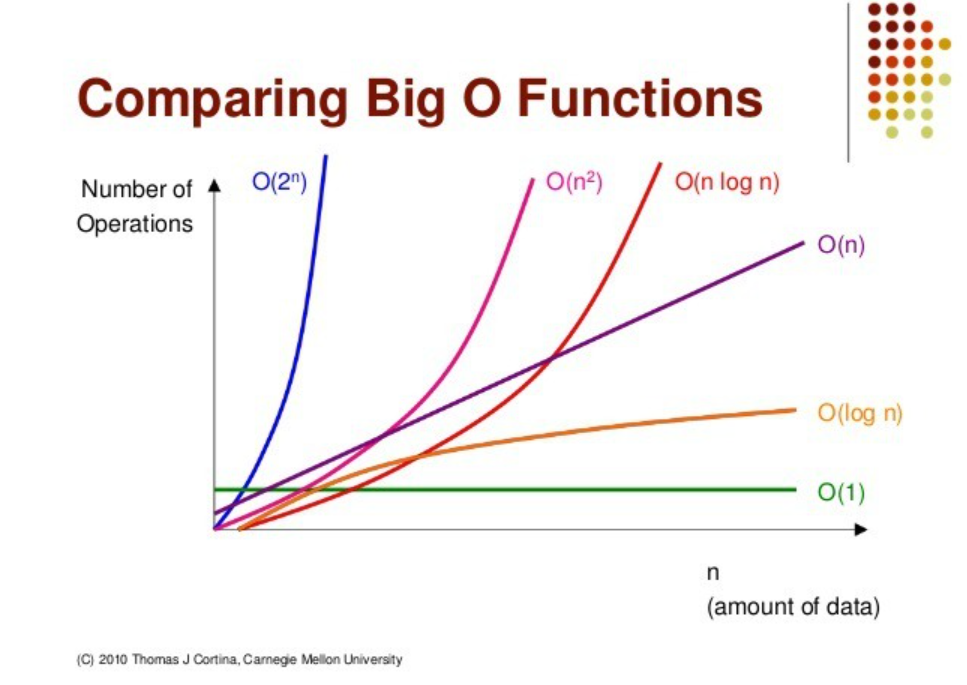

# Day3 정리
디자인 패턴 중 빌더 패턴에 대해서 설명해주세요.

→ 디자인 패턴 중 ***생성*** 패턴에 해당하는 빌더 패턴은 복잡한 객체를 생성하는 클래스와 표현하는 클래스를 분리하여, 동일한 절차에서도 서로 다른 표현을 생성하는 방법을 제공한다.

저번에 자바에서 추상 클래스에 대해서 학습했는데, 그렇다면 인터페이스와는 어떠한 차이점이 있나요?

→ 추상 클래스는 추상 클래스를 상속받아서 기능을 이용하고, 확장시키는 데 있습니다. 

반면에 인터페이스는 함수의 껍데기만 있는데 그 이유는 그 함수의 구현을 강제하기 위해서이다. 구현을 강제함으로써 구현 객체의 같은 동작을 보장할 수 있다.

자바는 다중 상속을 지원하지 않기 때문에 인터페이스는 여러개의 인터페이스를 구현할 수 있습니다.

ref

https://brunch.co.kr/@kd4/6

스니핑에 대해서 설명해주세요.

→ 스니핑은 해킹의 한 기법으로서, 네트워크 상에서 자신이 아닌 다른 상대방들의 패킷 교환을 엿듣는 것을 의미합니다.

애플리케이션 성능 측정 지표는 어떠한 것이 있나요?

- 처리량(Throughput)
    - 일정 시간 내에 애플리케이션이 처리하는 일의 양
- 응답시간(Response Time)
    - 애플리케이션에 요청을 전달한 시간부터 응답이 도착할 때까지 걸린 시간
- 경과시간(Turn Around Time)
    - 애플리케이션에 작업을 의뢰한 시간부터 처리가 완료될 때까지 걸린 시간
- 자원 사용률(Resource Usage)
    - 애플리케이션이 외뢰한 작업을 처리하는 동안의 CPU 사용량, 메모리 사용량, 네트워크 사용량 등 자원 사용률

ref

https://naminal.tistory.com/180#google_vignette

알고리즘 시간 복잡도를 표현 하는 방식 중 ‘빅오 표기법’이 있습니다. 어떠한 것인지 설명하고 몇가지 예시를 알려주세요.

→ 빅오 표기법은 알고리즘의 효율성을 표기해주는 표기법이다.

빅오표기법 성능 비교




빅오 표기법 예제

1. O(1) : 스택에서 Push, Pop
2. O(log n) : 이진트리
3. O(n) : for 문
4. O(n log n) : 퀵 정렬(quick sort), 병합정렬(merge sort), 힙 정렬(heap Sort)
5. O(): 이중 for 문, 삽입정렬(insertion sort), 거품정렬(bubble sort), 선택정렬(selection sort)
6. O() : 피보나치 수열

SQL은 사용용도에 따라 DDL, DML, DCL로 구분하는데, 각각의 용도와 예시를 설명해주세요

→ DDL : 
- 예시 : create, drop

→ DML :
- 예시 : insert, update, delete

→ DCL :
- 예시 : commit, rollback

OSi 7계층 중 애플리케이션 계층(Application Layer)에 대해 설명해주세요. 추가로 소켓과 어떠한 연관이 있나요?

→ OSI 7 계층은 네트워크에서 통신이 일어나는 과정을 7단계로 나눈 것을 말한다.


1계층 - 물리계층(Physical Layer)
이 계층에서는 주로 전기적, 기계적, 기능적인 특성을 이용해서 통신 케이블로 데이터를 전송하게 된다.

2계층 - 데이터 링크계층(DataLink Layer)

물리계층을 통해 송수신되는 정보의 오류와 흐름을 관리하여 안전한 정보의 전달을 수행할 수 있도록 도와주는 역할을 한다.
따라서 통신에서의 오류도 찾아주고 재전송도 하는 기능을 가지고 있는 것이다.

3계층 - 네트워크 계층(Network Layer)

이 계층에서 가장 중요한 기능은 데이터를 목적지까지 가장 안전하고 빠르게 전달하는 기능(라우팅)이다.
이 계층은 경로를 선택하고 주소를 정하고 경로에 따라 패킷을 전달해주는 것이 이 계층의 역할이다.

4계층 - 전송 계층(Transport Layer)

통신을 활성화하기 위한 계층이다. 보통 TCP프로토콜을 이용하며, 포트를 열어서 응용프로그램들이 전송을 할 수 있게 한다.
만약 데이터가 왔다면 4계층에서 해당 데이터를 하나로 합쳐서 5계층에 던져 준다.
단대단 오류제어 및 흐름제어 이 계층 까지는 물리적인 계층에 속한다.(TCP/UDP프로토콜을 사용한다.)

5계층 -세션 계층(Session Layer)

데이터가 통신하기 위한 논리적인 연결을 말한다. 통신을 하기위한 대문이라고 보면 된다.
세션 계층(Session layer)은 양 끝단의 응용 프로세스가 통신을 관리하기 위한 방법을 제공한다.
동시 송수신 방식(duplex), 반이중 방식(half-duplex), 전이중 방식(Full Duplex)의 통신과 함께, 체크 포인팅과 유휴, 종료, 다시 시작 과정 등을 수행한다.

6계층 - 표현 계층(Presentation Layer)

데이터 표현이 상이한 응용 프로세스의 독립성을 제공하고, 암호화 한다.
표현 계층(Presentation layer)은 코드 간의 번역을 담당하여 사용자 시스템에서 데이터의 형식상 차이를 다루는 부담을 응용 계층으로부터 덜어 준다.
인코딩이나 암호화 등의 동작이 이 계층에서 이루어진다.

7계층 - 응용 계층(Application Layer)

최종 목적지로서 HTTP, FTP, SMTP, POP3, IMAP, Telnet 등과 같은 프로토콜이 있다.
해당 통신 패킷들은 방금 나열한 프로토콜에 의해 모두 처리되며 우리가 사용하는 브라우저나, 메일 프로그램은 프로토콜을 보다 쉽게 사용하게 해주는 응용프로그램이다.

※ 소켓

응용 계층(Application Layer)은 요구사항을 처리하기 위해 네트워크 통신을 이용한 데이터의 송-수신이 발생하는 가장 마지막 영역 입니다.

운영체제는 전송 계층에서 제공하는 API를 활용하여 네트워크 통신을 가능토록 API를 제공하는데, 이를 소켓 API라 부릅니다. 해당 계층은 소켓 프로그래밍을 통해 데이터를 송신 및 수신을 수행합니다.

ref 

https://mommoo.tistory.com/107

https://shlee0882.tistory.com/110

XSS(Cross-Site Scripting) 공격은 무엇인가요?

→ ***크로스 사이트 스크립팅*** (또는 교차 사이트 스크립팅(**Cross Site Scripting**, XSS))은 공격자가 상대방의 브라우저에 스크립트가 실행되도록 해 사용자의 세션을 가로채거나, 웹사이트를 변조하거나, 악의적 콘텐츠를 삽입하거나, 피싱 공격을 진행하는 것을 말합니다.

다음 프로그래밍의 결과는 무엇인가요?

```
#include <stdio.h> 

void main() {
    int i, j;
    int a[3][2] = {{1, 2}, {3, 4}, {5, 6}};
    int sum = 0;
    
    for (i = 0; i < 3; i++) {
        for (j = 0; j < 2; j++) {
            sum += a[i][j];
        }
    }
    
    printf("%.2f", (float)sum/(3*2));
}
```
→ 3.50
|a[0][0]|a[0][2]|a[0][2]|
|---|---|-----|
|1|2| |
|3|4| |
|5|6| |
(float)(1+2+3+4+5+6)/(3*2) = 3.5

%.2f → 소수점 두번째자리까지 표시

#
#
## Day3 한줄 정리
#
# 디자인 패턴 중 빌더 패턴에 대해서 설명해주세요.

→ 디자인 패턴 중 ***생성*** 패턴에 해당하는 빌더 패턴은 복잡한 객체를 생성하는 클래스와 표현하는 클래스를 분리하여, 동일한 절차에서도 서로 다른 표현을 생성하는 방법을 제공한다.

# 저번에 자바에서 추상 클래스에 대해서 학습했는데, 그렇다면 인터페이스와는 어떠한 차이점이 있나요?

→ 추상 클래스는 추상 클래스를 상속받아서 기능을 이용하고, 확장시키는 데 있습니다. 

반면에 인터페이스는 함수의 껍데기만 있는데 그 이유는 그 함수의 구현을 강제하기 위해서이다. 구현을 강제함으로써 구현 객체의 같은 동작을 보장할 수 있다.

자바는 다중 상속을 지원하지 않기 때문에 인터페이스는 여러개의 인터페이스를 구현할 수 있습니다.

# 스니핑에 대해서 설명해주세요.

→ 스니핑은 해킹의 한 기법으로서, 네트워크 상에서 자신이 아닌 다른 상대방들의 패킷 교환을 엿듣는 것을 의미합니다.

# 애플리케이션 성능 측정 지표는 어떠한 것이 있나요?

- 처리량(Throughput)
- 응답시간(Response Time)
- 경과시간(Turn Around Time)
- 자원 사용률(Resource Usage)

# 알고리즘 시간 복잡도를 표현 하는 방식 중 ‘빅오 표기법’이 있습니다. 어떠한 것인지 설명하고 몇가지 예시를 알려주세요.

→ 빅오 표기법은 알고리즘의 효율성을 표기해주는 표기법이다.
1. O(1) : 스택에서 Push, Pop
2. O(log n) : 이진트리
3. O(n) : for 문
4. O(n log n) : 퀵 정렬(quick sort), 병합정렬(merge sort), 힙 정렬(heap Sort)
5. O(): 이중 for 문, 삽입정렬(insertion sort), 거품정렬(bubble sort), 선택정렬(selection sort)
6. O() : 피보나치 수열

# SQL은 사용용도에 따라 DDL, DML, DCL로 구분하는데, 각각의 용도와 예시를 설명해주세요

→ DDL : 
- 예시 : create, drop

→ DML :
- 예시 : insert, update, delete

→ DCL :
- 예시 : commit, rollback

# OSi 7계층 중 애플리케이션 계층(Application Layer)에 대해 설명해주세요. 추가로 소켓과 어떠한 연관이 있나요?

→ OSI 7 계층은 네트워크에서 통신이 일어나는 과정을 7단계로 나눈 것을 말한다.
→ 물리 계층, 데이터링크 계층, 네트워크 계층, 전송 계층, 세션 계층, 표현 계층, 응용 계층이 있다.

※ 소켓

응용 계층(Application Layer)은 요구사항을 처리하기 위해 네트워크 통신을 이용한 데이터의 송-수신이 발생하는 가장 마지막 영역 입니다.

운영체제는 전송 계층에서 제공하는 API를 활용하여 네트워크 통신을 가능토록 API를 제공하는데, 이를 소켓 API라 부릅니다. 해당 계층은 소켓 프로그래밍을 통해 데이터를 송신 및 수신을 수행합니다.

# XSS(Cross-Site Scripting) 공격은 무엇인가요?

→ XSS(Cross Site Scripting)은 상대방의 브라우저에 스크립트가 실행되도록 해 사용자의 세션을 가로채거나, 웹사이트를 변조하거나, 악의적 콘텐츠를 삽입하거나, 피싱 공격을 진행하는 것을 말한다.

# 다음 프로그래밍의 결과는 무엇인가요?
```
#include <stdio.h> 

void main() {
    int i, j;
    int a[3][2] = {{1, 2}, {3, 4}, {5, 6}};
    int sum = 0;
    
    for (i = 0; i < 3; i++) {
        for (j = 0; j < 2; j++) {
            sum += a[i][j];
        }
    }
    
    printf("%.2f", (float)sum/(3*2));
}
```
→ 3.50