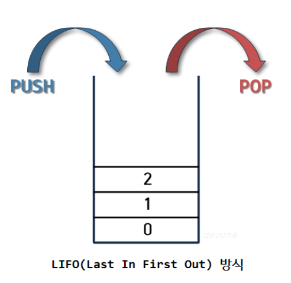

# Day4 정리
디자인 패턴 중 팩토리 메서드 패턴에 대해서 설명해주세요.

→  Factory Method Pattern (팩토리 메소드 패턴) 은 생성 패턴 중 하나로 객체를 생성할 때 어떤 클래스의 인스턴스를 만들 지 서브 클래스에서 결정하게 합니다.

자바에서 프로세스와 스레드의 차이점이 무엇입니까?

→ 프로세스는 하나의 프로그램이 OS에게 메모리를 할당받아 실행되고 있는 것이며, 스레드는 그 프로세스 내에서 실행되는 작업의 흐름 단위입니다.

DOS 공격 기법 중 죽음의 핑(Ping of Death) 공격에 대해 설명해주세요.

→ 규정 크기 이상의 ICMP 패킷으로 시스템을 마비시키는 공격을 말한다.

DOS 공격 기법 중 랜드 어택(Land Attack)에 대해 설명해주세요.

→ 출발지와 목적지의 ip주소가 공격자의 ip와 동이랗게 만들어서 공격 대상에세 보내는 공격입니다. 루프 상태에 빠지게 되어 결국 ip프로토콜 스택에 장애를 유발하게 됩니다. 

REF

https://m.blog.naver.com/kji9653/221984556593

스택과 큐의 차이점에 대해서 설명해주세요.

스택 : 쌓아 올리는 것을 의미하며, 차곡차곡 쌓아 올린 형태의 자료구조를 말한다. (LIFO ; Last In First Out)



큐 : 선입선출(FIFO, First In First Out) 방식의 자료구조를 말한다.


차이점 : 데이터를 엑세스 하는 순서의 차이가 있습니다.

스택은 선입선출이며, 큐는 선입선출이지만 처음 추가된 요소가 가장 먼저 제거되는 것이 차이가 있습니다.

ref

https://devuna.tistory.com/22

페이지 교체 알고리즘에 대해서 설명하고 종류와 차이점에 대해 설명해주세요.
(FIFO, LRU, LFU, NUR)

- FIFO(First In First Out)

→ 가장 먼저 들어온 페이지를 교체

- LRU(Least Recently Used)

→ 가장 오랫동안 사용되지 않은 페이지 교체

- LFU(Least Frequently Used)

→ 참조 횟수가 가장 작은 페이지 교체

- NUR(Not Used Recently)

→ 최근에 사용하지 않은 페이지 교체

ref

https://doh-an.tistory.com/28

OSi 7계층 중 표현 계층(Presentation Layer)에 대해 설명해주세요. 

→ 표현 계층(Presentation layer)은 코드 간의 번역을 담당하여 사용자 시스템에서 데이터의 형식상 차이를 다루는 부담을 응용 계층으로부터 덜어 준다.
인코딩이나 암호화 등의 동작이 이 계층에서 이루어진다.

다음 프로그래밍의 결과는 무엇인가요?
```
#include <stdio.h>
 
struct jsu 
{
  char name[12];
  int os, db, hab, hhab;
};
 
int main()
{
   struct jsu st[3] = {{"데이터1", 95, 88}, {"데이터2", 84, 91}, {"데이터3", 86, 75}};
   struct jsu* p;
 
   p = &st[0];
 
   (p + 1)->hab = (p + 1)->os + (p + 2)->db;
   (p + 1)->hhab = (p+1)->hab + p->os + p->db;
 
   printf("%d\n", (p+1)->hab + (p+1)->hhab);
}
```
→ 501

#
#
# Day4 한줄 요약
#
# 디자인 패턴 중 팩토리 메서드 패턴에 대해서 설명해주세요.

→  **팩토리 메소드 패턴**은 **생성** 패턴 중 하나로 객체를 생성할 때 어떤 클래스의 인스턴스를 만들 지 서브 클래스에서 결정하게 합니다.

# 자바에서 프로세스와 스레드의 차이점이 무엇입니까?

→ 프로세스는 하나의 프로그램이 OS에게 메모리를 할당받아 실행되고 있는 것이며, 스레드는 그 프로세스 내에서 실행되는 작업의 흐름 단위입니다.

# DOS 공격 기법 중 죽음의 핑(Ping of Death) 공격에 대해 설명해주세요.

→ 규정 크기 이상의 ICMP 패킷으로 시스템을 마비시키는 공격을 말한다.

# DOS 공격 기법 중 랜드 어택(Land Attack)에 대해 설명해주세요.

→ 출발지와 목적지의 ip주소가 공격자의 ip와 동이랗게 만들어서 공격 대상에세 보내는 공격입니다. 루프 상태에 빠지게 되어 결국 ip 프로토콜 스택에 장애를 유발하게 됩니다. 

# 스택과 큐의 차이점에 대해서 설명해주세요.

스택 : 쌓아 올리는 것을 의미하며, 차곡차곡 쌓아 올린 형태의 자료구조를 말한다. (LIFO ; Last In First Out)

큐 : 선입선출(FIFO, First In First Out) 방식의 자료구조를 말한다.

차이점 : 스택은 LIFO이며, 큐는 FIFO 방식의 자료구조로 큐는 처음 추가된 요소가 가장 먼저 제거되는 것이 차이가 있습니다.

# 페이지 교체 알고리즘에 대해서 설명하고 종류와 차이점에 대해 설명해주세요.
(FIFO, LRU, LFU, NUR)

- FIFO(First In First Out)
→ 가장 먼저 들어온 페이지를 교체

- LRU(Least Recently Used)
→ 가장 오랫동안 사용되지 않은 페이지 교체

- LFU(Least Frequently Used)
→ 참조 횟수가 가장 작은 페이지 교체

- NUR(Not Used Recently)
→ 최근에 사용하지 않은 페이지 교체

# OSi 7계층 중 표현 계층(Presentation Layer)에 대해 설명해주세요. 

→ 표현 계층은 코드 간의 **번역**을 담당하여 사용자 시스템에서 **데이터의 형식상 차이**를 다루는 부담을 응용 계층으로부터 덜어 준다.
**인코딩**이나 **암호화** 등의 동작이 이 계층에서 이루어진다.

# 다음 프로그래밍의 결과는 무엇인가요?
```
#include <stdio.h>
 
struct jsu 
{
  char name[12];
  int os, db, hab, hhab;
};
 
int main()
{
   struct jsu st[3] = {{"데이터1", 95, 88}, {"데이터2", 84, 91}, {"데이터3", 86, 75}};
   struct jsu* p;
 
   p = &st[0];
 
   (p + 1)->hab = (p + 1)->os + (p + 2)->db;
   (p + 1)->hhab = (p+1)->hab + p->os + p->db;
 
   printf("%d\n", (p+1)->hab + (p+1)->hhab);
}
```
→ 501