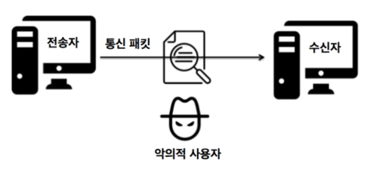
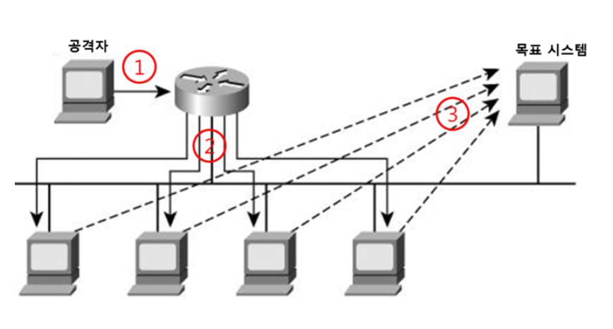

# Day6 240314 정리
#
# 디자인 패턴 중 싱글톤 패턴에 대해서 설명해주세요.
- 생성자가 여러 차례 호출되더라도 실제로 생성되는 객체는 하나이다.
- 최초 생성 이후에 호출된 생성자는 최초의 생성자가 생성한 객체를 리턴한다.
# 자바에서 제네릭은 무엇이고 왜 쓰는지 알려주세요.
- 클래스 내부에서 지정하는 것이 아닌 외부에서 사용자에 의해 지정되는 것을 의미한다.
- 제네릭의 장점
    - 잘못된 타입이 들어올 수 있는 것을 **컴파일 단계에서 방지**할 수 있다.
    - 클래스 외부에서 타입을 지정하기 때문에 따로 타입을 체크하고 변환해줄 필요가 없다. 즉, **관리하기가 편하다.**
    - 비슷한 기능을 지원하는 경우 코드의 **재사용성**이 높아진다.

# PL/SQL에 대해서 설명해주세요.
- 오라클 DBMS에서 **SQL 언어를 확장**하기 위해 사용하는 프로그래밍 언어 중 하나이다.
# 공격 기술 중 스푸핑에 대해서 설명해주세요.
- 직접적으로 시스템에 침입을 시도하지 않고 피해자가 공격자의 악의적인 시도에 의한 *잘못된 정보* 혹은 *연결을 신뢰*하게끔 만드는 기법이다.
# 공격 기술 중 스니핑에 대해서 설명해주세요.
- 네트워크상에서 자신이 아닌 다른 상대방들의 *패킷 교환*을 엿듣는 것을 의미한다.



# 공격 기술 중 파밍에 대해서 설명해주세요.
- 사용자가 자신의 웹 브라우저에서 정확한 웹 페이지 주소를 입력해도 가짜 웹 페이지에 접속하게 하여 개인정보를 훔치는 것을 말한다.
# 공격 기술 중 피싱에 대해서 설명해주세요.
- 공격자가 사람들을 속여 사기에 빠지도록 고안된 악성 이메일을 보내는 것을 의미한다.
# 공격 기술 중 스머핑에 대해서 설명해주세요.
- 희생자의 스푸핑된 원본 IP를 가진 수많은 인터넷 제어 메시지 프로토콜 패킷들이 **IP 브로드캐스트 주소**를 사용하여 컴퓨터 네트워크로 브로드캐스트하는 **분산 서비스 거부** 공격이다.

※ 스머핑 예시



1. 공격자는 발신주소를 목표 시스템의 IP로 변경하여 브로드캐스팅으로 ICMP echo를 요청합니다.
2. ICMP echo는 브로드캐스팅되어 네트워크 내에 존재하는 모든 컴퓨터에 전달됩니다.
3. ICMP echo를 받은 컴퓨터는 응답 ICMP 메시지를 목표 시스템으로 송신합니다.
4. 목표 시스템은 과부하가 발생하여 정상적인 서비스가 불가능하게 됩니다.

# 데이터베이스에서 스키마는 무엇이고 어떤게 있나요?
- 데이터베이스에서 자료의 구조, 자료의 표현 방법, 자료 간의 관계를 형식 언어로 정의한 구조이다.
# 다음 프로그래밍의 결과는 무엇인가요?
```
#include <stdio.h>

void main()
{
	int i=0, c=0;
	while (i<10)
    {
		i++;
		c*=i;
    }
	printf("%d",c);
}
```
-> 6,480