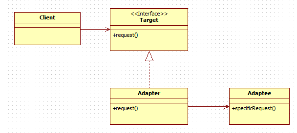

# Day 8 정리
# 1. 디자인 패턴 중 어댑터 패턴에 대해서 설명해주세요.

- 호환되지 않는 인터페이스를 가진 객체들이 협업할 수 있도록 해주는 ***구조적*** 디자인 패턴이다.




# 2. MVC패턴에 대해서 설명해주세요.

- MVC (모델(Model)-뷰(View)-컨트롤러(Controller)) 는 *사용자 인터페이스*, *데이터 및 논리 제어*를 구현하는데 널리 사용되는 소프트웨어 디자인 패턴입니다. 

# 3. 데이터베이스 이상현상(Anomaly)의 종류 3가지는 무엇인가요?
- 갱신 이상 (Modification ANomaly)
- 삽입 이상(Insertion Anomaly)
- 삭제 이상(Deletion Anomaly)

ref
https://dev-coco.tistory.com/63


# 4. 데이터베이스 구축 과정 5가지를 알려주세요.
- 요구 사항 분석
- 개념적 설계
- 논리적 설계
- 물리적 설계 (정규화)
- 구현

-> 요(개논물)구

# 5. UML은 무엇인가요?

-> UML은 Unified Modeling Language의 약자로 *통합 모델링 언어*라는 뜻입니다.

# 6. CSRF는 무엇인가요?

- Cross-Site Request Forgery는 사이트 간 요청 위조의 줄임말이다.
- 웹 애플리케이션 취약점 중 하나로 사용자가 자신의 의지와 무관하게 공격자가 의도한 행동을 해서 특정 웹페이지를 보안에 취약하게 한다거나 수정, 삭제 등의 작업을 하게 만드는 공격 방법이다.

# 7. 공개키 암호화 방식 중 RSA는 무엇인가요?

- 로널드 다이베스트, 아디 샤미르, 레너드 애들먼의 앞글자를 딴 비대칭 키 암호화 알고리즘
- 현재 비대칭 키 암호 방식 중에서 가장 널리 쓰이고 있는 방식으로서, **소인수 분해**의 어려움을 이용한 방식이다. 
- RSA - 소인수 분해 방식, 공개키 알고리즘


ref

https://velog.io/@gyrbs22/%EC%A0%95%EB%B3%B4%EC%B2%98%EB%A6%AC%EA%B8%B0%EC%82%AC-5%EA%B3%BC%EB%AA%A9-%EC%86%8C%ED%94%84%ED%8A%B8%EC%9B%A8%EC%96%B4%EC%8B%9C%EC%8A%A4%ED%85%9C-%EB%B3%B4%EC%95%88-%EA%B5%AC%EC%B6%95-%EA%B4%80%EB%A0%A8-%EC%95%94%EA%B8%B0%ED%95%AD%EB%AA%A9

https://devzzi.tistory.com/42


# 8. VPN은 무엇인가요?

-> VPN이란 Virtual Private Network(가상 사설망)의 줄임말로, 원격으로 회사나 해외 등의 다른 네트워크를 이용할 수 있게 해주고, 자신의 인터넷 사용 기록과 IP, 위치 등을 숨길 수 있어 보안성도 높일 수 있다.

# 9. OSI 7계층 중 전송 계층(Transport Layer)에 대해서 설명해주세요.

- 전송 계층(Transport layer)은 계층 구조의 *네트워크 구성요소*와 프로토콜 내에서 **송신자와 수신자**를 *연결*하는 통신 서비스를 제공한다. 
- 전송 계층은 연결 지향 데이터 스트림 지원, 신뢰성, 흐름 제어, 그리고 다중화와 같은 편리한 서비스를 제공한다.

# 10. 다음 프로그래밍의 결과는 무엇인가요?
```
#include <stdio.h>

int main() {
    int E[] = {64, 25, 12, 22, 11};
    int n = sizeof(E) / sizeof(E[0]);
    int i = 0;
    do {
        int j = i + 1;
        do {
            if (E[i] > E[j]) {
                int temp = E[i];
                E[i] = E[j];
                E[j] = temp;
            }
            j++;
        } while (j < n); 
        i++;
    } while (i < n - 1); 

    for (int i = 0; i < n; i++)
        printf("%d ", E[i]);
}

```

-> 11 12 22 25 64