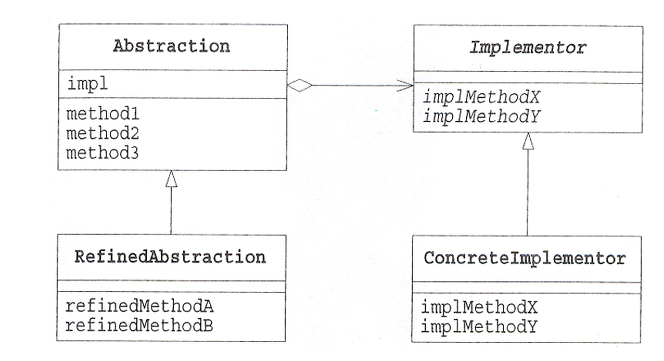

# Day9 정리
# 1. 디자인 패턴 중 브리지 패턴에 대해서 설명해주세요.

- 브리지 패턴(Bridge Pattern)은 객체의 구현부와 추상적인 부분을 *분리*하여 각각을 독립적으로 변형할 수 있게 하는 디자인 패턴 중 하나이다. 
- 브리지 패턴을 사용하면 추상화와 구현을 분리하여 클래스 간의 결합도를 낮출 수 있으며, 이는 코드의 재사용성과 유연성을 높일수 있게 해준다.

ref

https://ssow93.tistory.com/49

# 2. 플랫폼 가상화와 리소스 가상화를 각각 설명해주세요.

- 플랫폼 가상화 : ***하드웨어 플랫폼*** 위에서 실행되는 호스트 프로그램이 게스트 프로그램을 만들어 마치 독립된 환경을 만들어 낸 것처럼 보여주는 기법

- 리소스 가상화 : ***게스트 소프트웨어*** 위에서 사용자는 독립된 하드웨어에서 소프트웨어가 실행되는 것처럼 활용하는 기법

ref 

https://gaebom.tistory.com/59

# 3. 가상화 기술요소 중 컴퓨팅 가상화는 무엇인가요?

- 컴퓨팅 가상화 : 물리적으로 ***컴퓨터 리소스***를 가상화하여 논리적 단위로 리소스를 활용할 수 있도록 하는 기술

# 4. 가상화 기술요소 중 스토리지 가상화는 무엇인가요?

- **스토리지**와 서버 사이에서 SW/HW 계층 추가
- **스토리지**를 논리적으로 제어 및 활용할 수 있도록 하는 기술
- 이기종 스토리지 시스템의 통합을 가능하게 하는 기술

# 5. 가상화 기술요소 중 I/O 가상화는 무엇인가요?

- **서버와 I/O** 디바이스 사이에 위치하는 미들웨어 계층
- **서버의 I/O** 자원을 물리적으로 분리

# 6. 가상화 기술요소 중 컨테이너는 무엇인가요?
- 컨테이너화된 애플리케이션들이 단일 운영체제상에서 실행되도록 하는 기술

# 7. 가상화 기술요소 중 분산처리 기술는 무엇인가요?
- 여러대의 컴퓨터 계산 및 저장능력을 이용하여, 커다란 계산 문제나 대용량 데이터를 처리하고 저장하는 기술

# 8. 가상화 기술요소 중 네트워크 가상화는 무엇인가요?
- 물리적으로 떨어져 있는 다양한 장비들을 연결하기 위한 수단

# 9. OSI 7계층 중 네트워크 계층(Network Layer)에 대해서 설명해주세요.

- 실제 네트워크 간 라우팅을 담당하는 계층이다.

- IP주소등을 통해 데이터를 목적지까지 가장 안전하고 빠르게 전달하는 역할을 하며 라우터를 통해 경로를 선택하여 경로에 따라 패킷을 전달한다. 

- 상대방이 제대로 받았는지에 대해서는 보장하지 않는 비연결형적인 특징을 가지고 있다.(낮은 신뢰성 -> 상위 계층에서 패킷 분실시 오류 복구)

-> 대표적인 프로토콜 IP, ARP

REF
https://velog.io/@alkwen0996/%EB%84%A4%ED%8A%B8%EC%9B%8C%ED%81%AC-%EB%84%A4%ED%8A%B8%EC%9B%8C%ED%81%AC-%EA%B3%84%EC%B8%B5%EA%B5%AC%EC%A1%B0OSI-7%EA%B3%84%EC%B8%B5-TCPIP-4%EA%B3%84%EC%B8%B5

# 10. 병행제어 기법 로킹(Locking)은 무엇인가요?

- 데이터베이스 병행 제어를 위해 트랜잭션(transaction)이 접근하고자 하는 데이터를 잠가(**lock**) ***다른 트랜잭션이 접근***하지 못하도록 하는 병행 제어 기법이다.

- 트랜잭션이 어떤 데이터에 접근하고자 할 때 로킹을 수행
- 로킹이 되어 있는 데이터에는 다른 트랜잭션이 접근할 수 없음
- 트랜잭션은 로킹이 된 데이터에 대해서만 연산을 수행
- 로킹 단위: 필드, 레코드, 테이블, 파일, 데이터베이스 모두 로킹 단위가 될 수 있다.
- 한 번에 로킹 할 수 있는 객체의 크기를 로킹 단위라고 한다.

REF 
https://devinus.tistory.com/25

# 면접 대비 질문 (서술형)
    
    : 자바 컬렉션의 구현체들인 List, Set, Map, Stack, Queue의 특징에 대해 설명해주세요.
- List : 
- Set : 
- Map :
- Stack :
- Queue : 