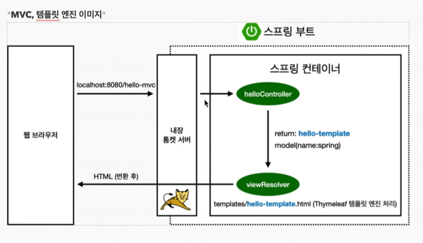
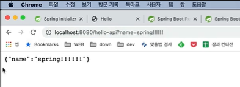

# MVC 템플릿 엔진

타임리프를 사용하면 파일 자체를 그대로 읽어온다.

> 타임리프 템플릿의 장점

HTML을 그대로 쓰고 그 파일을 서버 없이 바로 열어봐도 껍데기를 볼 수 있다.
템플릿 엔진으로 동작을 하면 HTML에 있는 값으로 이 내용이 치환이 된다.

> 코드 실행
```
@GetMapping("hello-mvc")
public String helloMvc(@RequestParam("name") String name, Model model{
	model.addAttribute("name", name);
	return "hello-template";
}
```
→ error 발생


> 에러 수정
```
@GetMapping("hello-mvc")
public String helloMvc(@RequestParam(name = "name", requierd = false) String name, Model model{
	model.addAttribute("name", name);
	return "hello-template";
}
```

> Required

Default값은 true로 무조건 값을 넣어야만 한다.

Default를 false로 하면 넘기지 않아도 된다.

Required가 기본이 true이기 때문에 일단 기본으로 값을 넘겨야 한다.

물음표 name은 http get 방식에서 물음표 and(&)로 파라미터를 넘겨줄 수 있다.

예 : localhost:8080/hello-mvc?name=spring!


> 위 실습의 컨트롤러 기능 설명

- 컨트롤러에서 name은 spring이라는 것으로 바뀐다.
- 뒤 파라미터도 name은 spring이라는 것으로 바뀌게 된다.
- 그리고 model에 담깁니다.
- 템플릿으로 넘어가 name은 spring으로 달러 표시(th:text=”${name}”)는 모델의 있는 값을 가져오는 것이다.
- 모델의 키값이 name인 것에서 값을 꺼내 치환해준다.



# API

> @ResponseBody란
- html에 나오는 body 태그를 얘기하는 것이 아니다
- http에서 헤더와 바디가 있는 것을 http 통신 프로토콜이라 부른다.
- 바디부에 이 데이터를 내가 직접 넣어주겠다는 뜻이다. (return “hello “ + name)
- (return “hello “ + name) → hello spring 출력, 문자 자체가 요청한 클라이언트에 그대로 내려감.

> 템플릿 엔진과의 차이
- view 가 없다

> API 활용 소스 코드 (Json 활용)

문자가 아니라 데이터를 출력해야 할 때 API 방식 사용한다
```
@GetMapping(”hello-api”)
@ResponseBody
public Hello helloApi(@RequestParam("name") String name){
	Hello hello = new Hello();
	hello.setName(name);
	return hello;
}

static class Hello{
	private String name;
	
	//getter
	//setter
}
```



JSON은 키와 값을 가진다.

> XML 방식 예시
```
<HTML></HTML>
```

→ 객체를 반환하고 ResponseBody를 사용하면 JSON으로 반환한다.

> 정적 컨텐츠

→ 그냥 파일을 그대로 내려준다.


> MVC와 템플릿 엔진

→ 템플릿 엔진을 MVC방식으로 쪼갠다.

→ 뷰를 템플릿 엔진으로 HTML을 좀 더 프로그래밍 한 걸로 렌더링 한다.

→ 렌더링이 된 HTML을 고객에게 전달해준다.


> API

→ 보통 일반적으로 객체를 반환하는 것을 말한다.
(ResponseBody 객체 반환)

→ HTTP 메시지 컨버터를 통해서 JSON으로 반환해준다.

→ VIEW가 필요없이 바로 HTTP ResponseBody에 값을 넣어 반환함


# 정리

> 정적 컨텐츠

→ 그냥 파일을 그대로 내려준다.

> MVC와 템플릿 엔진

→ 템플릿 엔진을 MVC방식으로 쪼갠다.

→ 뷰를 템플릿 엔진으로 HTML을 좀 더 프로그래밍 한 걸로 렌더링 한다.

→ 렌더링이 된 HTML을 고객에게 전달해준다.

> API

→ 보통 일반적으로 객체를 반환하는 것을 말한다.
(ResponseBody 객체 반환)

→ HTTP 메시지 컨버터를 통해서 JSON으로 반환해준다.

→ VIEW가 필요없이 바로 HTTP ResponseBody에 값을 넣어 반환함