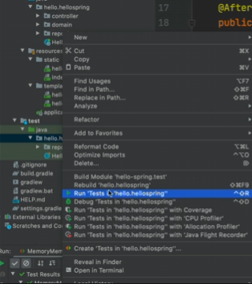

# 비즈니스 요구사항 정리

→ 데이터, 기능 정리

> 회원 관리 예제 비즈니스 요구사항 정리

- 데이터 : 회원 ID, 이름
- 기능 : 회원 등록, 조회
- 아직 데이터 저장소가 선정되지 않음 (가상의 시나리오)

→ 성능이 중요한 DB로 할지, 

→ 일반적 관계형 DB로 할지,

→ NoSQL로 할지 정하지 않음

> 회원 도메인과 리포지토리 만들기

- package hello.hellospring.domain에 코드 작성
```
package hello.hellospring.domain;

public class Member{
	private Long id;
	private String name;
	
	//ID getter
	//ID setter
	
	//name getter
	//name setter
}
```

- hello.hellospring.repository 생성
```
package hello.hellospring.repository;
import hello.hellospring.domain.Member;
import java.util.Optional;

public interface MemberRepository{
	// 회원소에 저장
	Member save(Member member); 
	
	// id와 name의 값을 가져올 수 있음.
	Optional<Member> findById(Long id); 
	Optional<Member> findByName(String name);
	
	// 지금까지 저장된 모든 회원 리스트를 다 반
	Optional<Member> findAll();
}
```

> Optional이란?

→ null 값을 가질 때 null을 그대로 반환하는 방법 대신

Optional을 사용하여
findByName이나 findById로 가져오는 것을 선호한다.


- MemoryMemberRepository 생성
```
package hello.hellospring.repository;

public class MemoryMemberRepository implements MemberRepository{
	
	
	private static Map<Long, Member> store = new HashMap<>();
	private static long sequence = 0L;
	
	@Override
	public Member save(Member member){
		member.setId(++sequence); //ID 세팅
		//store에 ID 저장, Map에 저장됨
		store.put(member.getId(), member); 
		return member;
	}
	
	@Override
	public Optional<Member> findById(Long id){
		return Optional.ofNullable(store.get(id));
	}
	
	@Override
	public Optional<Member> findByName(String name){
		return store.values().stream()
			.filter(member -> member.getName().equals(name))
			.findAny();
	}
	
	@Override
	public Optional<Member> findAll(){
		return new ArrayList<>(store.values());
	}
}
```

# 회원 리포지토리 테스트 케이스 작성

개발한 기능을 실행해서 테스트 할 때 자바의 메인 메서드를 통해서 실행하거나, 웹 애플리케이션의 컨트롤러를 통해서 해당 기능을 실행한다.


이러한 방법은 준비하고 실행하는데 오래 걸리고, 반복 실행하기 어렵고 여러 테스트를 한번에 실행하기 어렵다는 단점이 있다.

자바는 JUnit이라는 프레임워크로 테스트를 실행해서 이러한 문제를 해결한다.

```
package hello.hellospring.repository;

import hello.hellospring.domain.Member;
import org.junit.jupiter.api.AfterEach;
import org.junit.jupiter.api.Test;

import java.util.List;
import java.util.Optional;

import static org.assertj.core.api.Assertions.*;

class MemoryMemberRepositoryTest{

		MemoryMemberRepositiory repository = new MemoryMemberRepository();
		
		@AfterEach
		public void afterEach(){
			repository.clearStore();
		}
		
		@Test
		public void save(){
				Member member = new Member();
				member.setName("spring");	
				
				repository.save(member);
				Member result = repository.findById(member.getId()).get();
				//System.out.println("result = " + (result == member)); // result = true
				//Assertions.assertEquals(member, result);
				Assertions.assertThat(member).isEqualTo(result);
		}
		
		@Test
		public void findByName(){
				Member member1 = new Member();
				member1.setName("spring1");
				repository.save(member1);
				
				Member member2 = new Member();
				member2.setName("spring2");
				repository.save(member2);	
				
				//Member result = repository.findByName("spring1").get();
				Member result = repository.findByName("spring2").get();
				assertThat(result).isEqualTo(member1);
		}
		
		@Test
		public void findAll(){
				Member member1 = new Member();
				member1.setName("spring1");
				repository.save(member1);
				
				Member member2 = new Member();
				member2.setName("spring2");
				repository.save(member2);	
				
				List<Member> result = repository.findAll();
				
				assertThat(result.size()).isEqualTo(2); //3으로 변경 시 오류
		}
}
```


모든 테스트는 순서랑 상관없이 메소드별로 다 따로 동작하게만 설계를 해야 된다. findAll이 먼저 실행되었는데, 이 순서가 자기들이 알아서 잡는 것이다. 

순서에 의존적으로 설정하면 절대 안 된다. findbyname 할 때 다른 객체가 이전에 저장했던 spring1이 나온 것이다. 

이 테스트 문제 해결 방법은 테스트가 하나 끝나고 나면 데이터를 클리어 해줘야 한다.


데이터를 클리어 하기 위해서는 다음과 같은 코드를 작성하면 된다.

```
# MemoryMemberRepositiory.class 

@AfterEach
public void clearStore(){
		store.clear();
}
```

```
# MemoryMemberRepositoryTest.class
		
		@AfterEach
		public void afterEach(){
			repository.clearStore();
		}
```

afterEach는 콜백 메서드라고 한다. 이렇게 하면 테스트가 실행이 되고 끝날 때마다 저장소를 비운다. 이러면 순서와 상관이 없어진다.


테스트는 서로 그 순서와 관계없이 서로 의존관계 없이 설계가 돼야 한다. 그러기 위해선 하나의 테스트가 끝날 때마다 저장소나 공용 데이터들을 다시 깔끔하게 지워줘야 한다. 그래야 문제가 생기지 않는다.

지금까지 메모리 멤버 리포지토리를 개발을 한 다음에 테스트를 작성했다.

이것을 뒤집어서 이 테스트 클래스를 먼저 작성한 다음, 멤버 메모리 리포지토리를 작성할 수 있다.

이것을 테스트 주도 개발, ***TDD***라고 한다.
테스트를 먼저 만들고 구현 클래스를 만들어서 돌려보는 것이다. 

현재 코드로 작성한 것은 TDD가 아니고 그냥 테스트를 만들어서 돌려본 것이다. 왜냐하면 구현 클래스를 먼저 만들고 그 다음에 이거를 잘 작동하는지 테스트를 작성한 것이기 때문이다.




추후 수십 수백만개의 테스트를 하려면 여기서 빌드하거나 테스트하면 된다.


# 회원 서비스 개발

```
public class MemberService{
		private final MemberRepository memberRepository = new MemoryMemberRepository();
		
		// 회원 가입
		public Long join(Member member){
			validateDuplicateMember(member); // 중복 회원 검증
			// 검증이 완료되면 저장
			memberRepository.save(member);
			return member.getId();
		}
		
				
		private void validateDuplicateMember(Member member){
						// 같은 이름이 있는 중복 회원 X
			
						/* Optional<Member> result = memberRepository.findByName(member.getName());
			
						 result.orElseGet
						result.ifPresent(m -> {
								throw new IllegalStateException("이미 존재하는 회원입니다.");
						});*/
						
						memberRepository.findByName(member.getName())
							.ifPresent(m -> {
									throw new IllegalStateException("이미 존재하는 회원입니다.");
						});
		}
		
		// 전체 회원 조회
		public List<Member> findMembers(){
				return memberRepository.findAll();
		}
		
		public Optional<Member> findOne(Long memberId){
				return memberRepository.findById(memberId);
		}
}
public class MemberService{
		private final MemberRepository memberRepository = new MemoryMemberRepository();
		
		// 회원 가입
		public Long join(Member member){
			validateDuplicateMember(member); // 중복 회원 검증
			// 검증이 완료되면 저장
			memberRepository.save(member);
			return member.getId();
		}
		
				
		private void validateDuplicateMember(Member member){
						// 같은 이름이 있는 중복 회원 X
			
						/* Optional<Member> result = memberRepository.findByName(member.getName());
			
						 result.orElseGet
						result.ifPresent(m -> {
								throw new IllegalStateException("이미 존재하는 회원입니다.");
						});*/
						
						memberRepository.findByName(member.getName())
							.ifPresent(m -> {
									throw new IllegalStateException("이미 존재하는 회원입니다.");
						});
		}
		
		// 전체 회원 조회
		public List<Member> findMembers(){
				return memberRepository.findAll();
		}
		
		public Optional<Member> findOne(Long memberId){
				return memberRepository.findById(memberId);
		}
}
```

# 회원 서비스 테스트

Create New Test → JUnit 생성

- Class name : MemberServiceTest
- Destination package : hello.hellospring.service

```
pacakge hello.hellospring.service;

import org.junit.jupiter.api.Test;

import static org.junit.jupiter.api.Assertions.*;

class MemberServiceTest{
	
	MemberService = memberService = new MemberService();
	
	MemoryMemberRepositroy memberRepository = new MemoryMemberRepository();
	
	// 테스트 데이터 초기화
	@AfterEach
	public void afterEach(){
		repository.clearStore();
	}
	
	@Test
	void 회원가입(){
		//given - 회원 member 추가 (정상 작동 확인 케이스)
		Member member = new Member();
		member.setName("hello");
		
		//when
		Long saveId = memberService.join(member);
		
		//then
		Member findMember = memberService.findOne(saveId).get();
		assertThat(member.getName()).isEqualsTo(findMember.getName());
	}
	
	@Test
	public void 중복_회원_예외(){
		//given
		Member member1 = new Member();
		member1.setName("spring");
		
		Member member2 = new Member();
		member2.setName("spring");
		
		//when
		memberService.join(member1);
		/*
		try{
			memberService.join(member2);
			fail();
		} catch(IllegalStateException e){
			assertThat(e.getMessage()).isEqualTo("이미 존재하는 회원입니다.");
		}
		*/
		//assertThrows(IllegalStateException.class, ()-> memberService.join(member2));
		IllegalStateException e = assertThrows(IllegalStateException.class, ()-> memberService.join(member2));
		assertThat(e.getMessage()).isEqualTo("이미 존재하는 회원입니다.");
		
		//then
		
	}
	
	@Test
	void findMembers(){
	
	}
	
	@Test
	void findOne(){
	
	}
}
```

> given when then 문법

- given → 무언가 주어짐, 즉 이 데이터 기반으로 테스트 검증하려고 한다.
- when → 이거를 실행했을 때, 즉 이것을 테스트 검증하려고 한다.
- then → 결과가 이게 나와야 한다(검증부)

```
public class MemberService{
	private final MemberRepository memberRepository;
	
	public MemberService(MemberRepository memberRepository){
		this.memberRepository = memberRepository;
	}
}
```
```
class MemberServiceTest{
	
	MemberService = memberService;
	
	MemoryMemberRepositroy memberRepository;
	
	@BeforeEach
	public void beforeEach(){
		memberRepository = new MemoryMemberRepository();
		memberService = new MemberService(memberRepository);
	}
	
	// 테스트 데이터 초기화
	@AfterEach
	public void afterEach(){
		repository.clearStore();
	}
	
}
```

테스트를 실행할 때마다 데이터를 각각 생성해주어야 한다.

테스트는 독립적으로 실행되어야 되기 때문에 각 테스트 실행하기 전에 BeforeEach를 사용한다.


MemoryMemberRepositroy를 만들고, memberService에 넣어준다.

그러면 같은 메모리 멤버 리포지토리로 사용이 된다.


외부에서 메모리 멤버 리포지토리를 외부에서 넣어주는데,

이런 것을 Dependency Injection이라고 한다. 줄여서 DI라고 한다.
