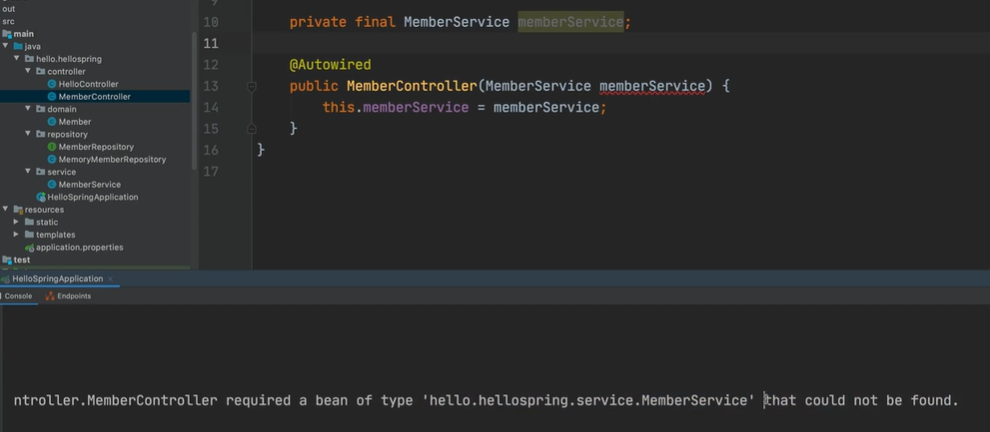
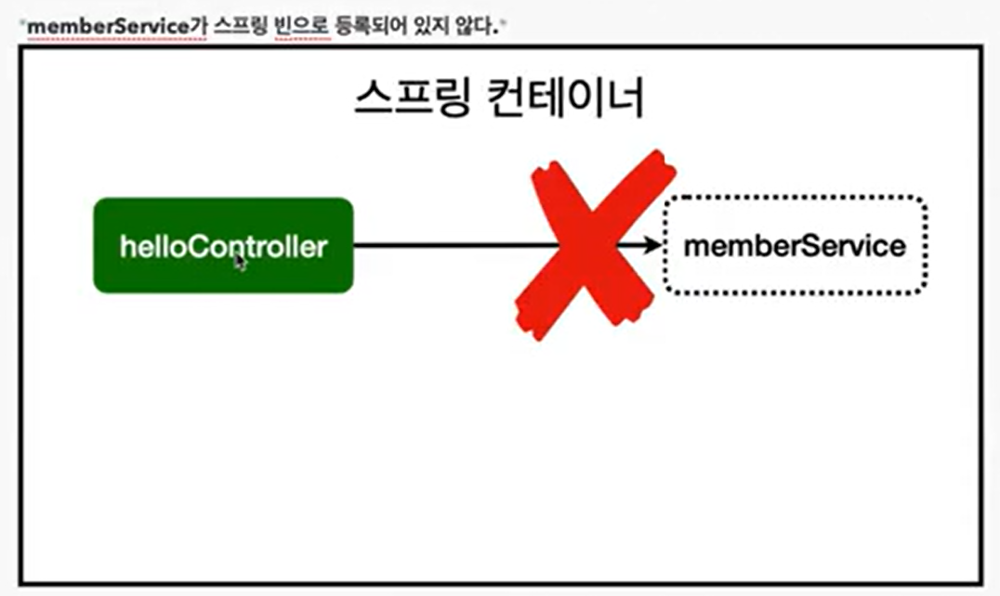
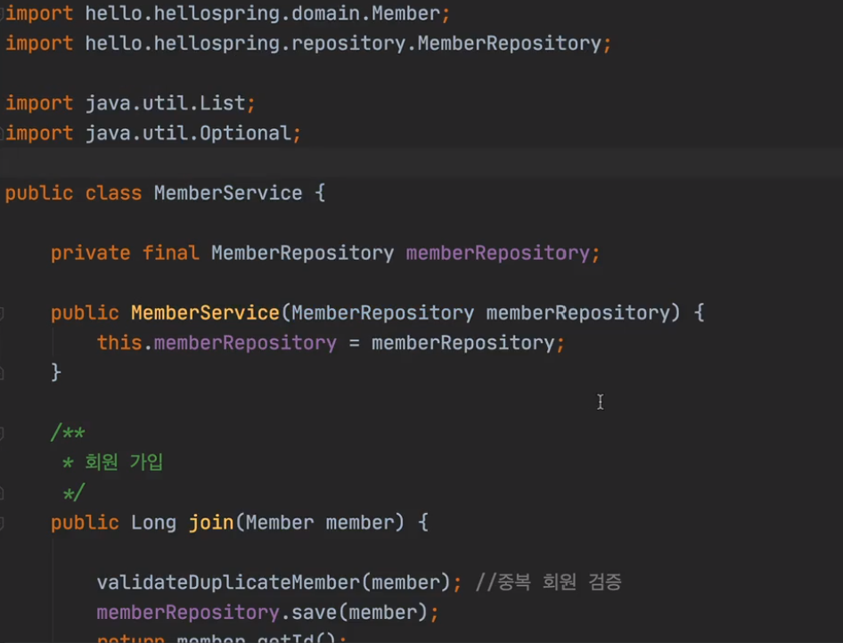
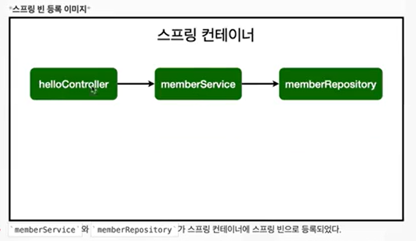

# 컴포넌트 스캔과 자동 의존관계 설정

> 스프링 빈을 등록하고, 의존 관계 설정하기

회원 컨트롤러가 회원 서비스와 회원 리포지토리를 사용할 수 있게 의존 관계를 준비하자.

그렇게 하려면 ***컨트롤러***와 ***뷰 템플릿***이 필요하다. 

회원 가입을 하고, 가입된 결과를 HTML로 뿌려주는 것들을 하려고 한다.

멤버 컨트롤러가 멤버 서비스를 통해서 회원 가입을 하고,

멤버 서비스를 통해서 데이터를 조회할 수 있어야 한다.

이런 것을 멤버 컨트롤러가 멤버 서비스를 의존한다고 한다.

> 컨트롤러의 기본 틀

```java
@Controller
public class MemberController{
	
}
```

스프링을 처음 작동할 때 Spring 컨테이너라는 Spring 통이 생성된다. 

거기에 이 컨트롤러 어노태이션이 있으면 이 멤버 컨트롤러 객체를 생성한다.

어노테이션으로 **@ Controller**라고 선언해야 이 클래스를 컨트롤러로 인식한다.

이것을 스프링 컨테이너에서 스프링 빈이 관리한다고 표현한다.

```java
@Controller
public class MemberController{
	// private final MemberService memberService = new MemberService();
	private final MemberService memberService;
	
	@Autowried
	public MemberController(MemberService memberService){
		this.memberService = memberService;
	}
}
```

생성자에 **@Autowried** 라고 되어있으면 멤버 서비스를 스프링 컨테이너에 있는 멤버 서비스와 **연결**을 시켜준다.



컨트롤러를 작성했는데도 오류가 발생한다.

could not be found 오류로 멤버 서비스를 찾을 수 없다고 한다.



@autowried 라고 되어 있으면 멤버 서비스를 스프링이 연결해준다.

그런데 Autowried를 해줬는데도 연결이 되지 않은 상태이다.



현재 memberService는 순수한 자바 클래스 코드이기 때문이다.

스프링이 이것을 멤버 서비스인지 모르기 때문에 연결이 되지 않는다.

```java
@Service
public class MemberService{
	private final MemberRepository memberRepository;
	
	public MemberService(MemberRepository memberRepositroy){
		...
	}
	
	...
}
```

멤버 서비스에도 @Service라고 어노테이션을 선언해주면,

스프링이 스프링 컨테이너에 서비스로 등록해준다.

```java
@Repository
public class MemoryMemberRepository implement MemberRepository{
	...
}
```

마찬가지로 리포지토리도 @Repository 라고 어노테이션을 선언해주면,

스프링이 스프링 컨테이너에 리포지토리로 등록해준다. 



memberService와 memberRepository가 스프링 컨테이너에 스프링 빈으로 등록되었다.

- 참고
    
    스프링은 스프링 컨테이너에 스프링 빈을 등록할 때, 기본으로 싱글톤으로 등록한다. (유일하게 하나만 등록해서 공유한다.) 따라서 같은 스프링 빈이면 모두 같은 인스턴스다. 설정으로 싱글통이 아니게 설정할 수 있지만, 특별한 경우를 제외하면 대부분 싱글톤을 사용한다.
    

**컨트롤러-서비스-리포지토리**로 연결된 정형화된 패턴이다.

컨트롤러를 통해서 외부 요청을 받고,

그 다음 서비스에 비즈니스 로직을 만들고,

리포지토리에서 데이터를 저장하는 방식이다.

생성자에서 autowired를 쓰면 멤버 컨트롤러가 생성이 될 때,

스프링 빈에 등록되어 있는 멤버 서비스를 객체에 가져다가 등록해줍니다.

이것을 **Dependency Injection** 이라고 합니다.

의존 관계를 주입하는 것을 말합니다.

> 스프링 빈을 등록하는 2가지 방법

- 컴포넌트 스캔과 자동 의존관계 설정
- 자바 코드로 직접 스프링 빈 등록하기


# 컴포넌트 스캔과 자동 의존관계 설정

- @Component 어노테이션이 있으면 스프링 빈으로 자동 등록된다
- @Controller 컨트롤러가 있으면 스프링 빈으로 자동 등록된 이유도 컴포넌트 스캔 때문이다.
- @Component 를 포함하는 다음 어노테이션도 스프링 빈으로 자동 등록된다
    - @Controller
    - @Service
    - @repository

# 자바 코드로 직접 스프링 빈 등록하기

우선 앞서 진행했던 코드에서 회원 서비스와 회원 리포지토리의 @Service, @Repositroy, @Autowried 어노테이션을 제거한다. 

그 다음 자바 코드로 직접 스프링 빈을 사용해 서비스와 리포지토리를 등록해보고자 한다.

```java
@Configuration
public class SpringConfig{
	@Been
	public MemberService memberService(){
		return new MemberService(memberRepository());
	}
	
	@Been
	public MemberRepositroy memberRepository(){
		return new MemoryMemberRepository():
	}
}
```

멤버 서비스와 리포지토리를 스프링빈에 등록을 한다.

스프링빈에 등록된 멤버 리포지토리를 멤버 서비스에 넣어준다.

이렇게 하면 컨트롤러-서비스-리포지토리가 연결된다.

앞으로는 메모리 리포지토리를 다른 리포지토리를 변경할 예정이므로, 컴포넌트 스캔 방식 대신에 자바 코드로 스프링 빈을 설정할 예정이다.

- 참고
    - XML로 설정하는 방식도 있지만 최근에는 XML을 사용하지 않기에 잘 사용하지 않는다.
    - DI에는 필드 주입, setter 주입, 생성자 주입 이렇게 3가지 방법이 있다. 의존 관계가 실행 중에 동적으로 변하는 경우는 거의 없으므로 생성자 주입을 권장한다.
    - 실무에서는 주로 정형화된 컨트롤러, 서비스, 리포지토리 같은 코드는 컴포넌트 스캔을 사용한다. 그리고 정형화되지 않거나, 상황에 따라 구현 클래스를 변경해야 하면 설정을 통해 스프링 빈으로 등록한다.
    - 주의 : @Autowried 를 통한 DI는 ‘helloController’, ‘MemberService’ 등과 같이 스프링이 관리하는 객체에서만 동작한다. 스프링빈으로 등록하지 않고 내가 직접 생성한 객체에서는 동작하지 않는다.